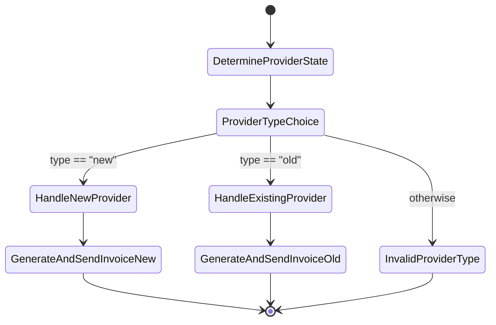

# Invoicer

A serverless application built with SST (Serverless Stack) for managing inventory, providers, and automated communications.

## Features

- Provider Management (New & Existing)
- Product Tracking with Vector Search
- Automated Invoice Generation
- Twilio Integration for Calls
- Redis-based Authentication
- Vector Embeddings for Similarity Search
- Step Functions Workflow

## Architecture

The application is built using:

- **SST (Serverless Stack)** - Infrastructure as code and development framework
- **AWS Services**
  - Lambda Functions
  - Step Functions
  - EventBridge
  - S3
  - API Gateway
- **Langchain**
- LLM framework for building AI applications
- **Database**
  - PostgreSQL with DrizzleORM
  - Vector embeddings for similarity search
- **AI/ML**
  - OpenAI GPT-4 for text processing
  - Vector embeddings for semantic search
- **External Services**
  - Twilio for communications
  - Upstash Redis for caching and auth

## Project Structure

├── packages/
│ ├── core/ # Shared business logic and types
│ ├── database/ # Database schemas and queries
│ └── functions/ # Lambda function handlers
├── stacks/ # SST infrastructure definitions
├── pnpm-workspace.yaml
└── sst.config.ts

## Getting Started

### Prerequisites

- Node.js 18+
- PNPM
- AWS Account
- OpenAI API Key
- Twilio Account
- Upstash Redis Account

### Installation

1. Clone the repository
2. Install dependencies:
   pnpm install

3. Set up environment variables using sst secrets set <key> <value>

OPENAI_API_KEY=
DATABASE_URL=
TWILIO_ACCOUNT_SID=
TWILIO_AUTH_TOKEN=
TWILIO_PHONE_NUMBER=
UPSTASH_REDIS_REST_URL=
UPSTASH_REDIS_REST_TOKEN=

4. Start development server:
   pnpm run dev

### Deployment

Deploy to AWS:

pnpm run deploy

# Workflow

The application uses AWS Step Functions to manage the provider onboarding process. Here's the workflow:

## Workflow Steps

1. **DetermineProviderState**: Identifies whether the provider is new or existing in the system
2. **ProviderTypeChoice**: Routes the workflow based on provider type
3. For new providers:
   - **HandleNewProvider**: Processes new provider registration
   - **GenerateAndSendInvoice**: Creates and sends initial invoice
4. For existing providers:
   - **HandleExistingProvider**: Updates existing provider information
   - **GenerateAndSendInvoice**: Creates and sends updated invoice
5. Invalid provider types trigger a failure state with `ProviderTypeError`

## Development

For local development with debugger:

1. Open VS Code
2. Use the provided launch configuration
3. Start debugging with F5
